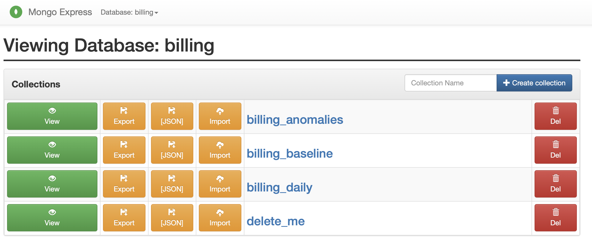
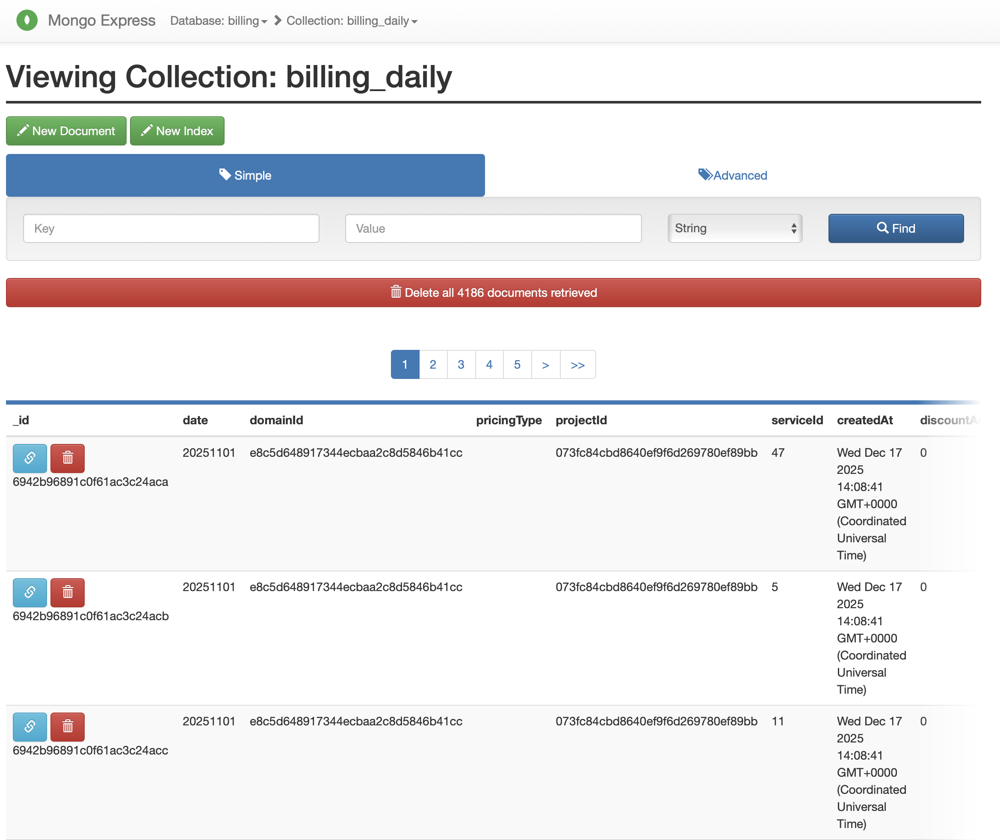
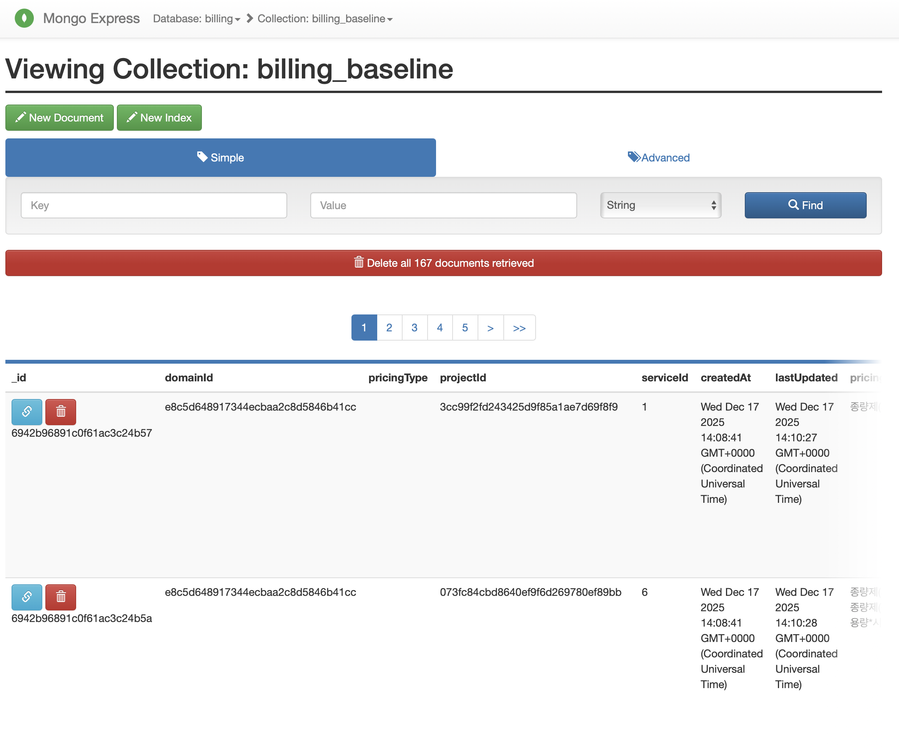
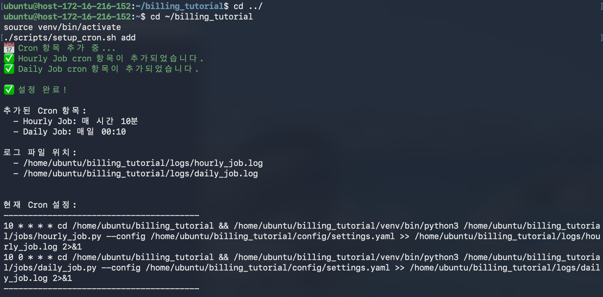
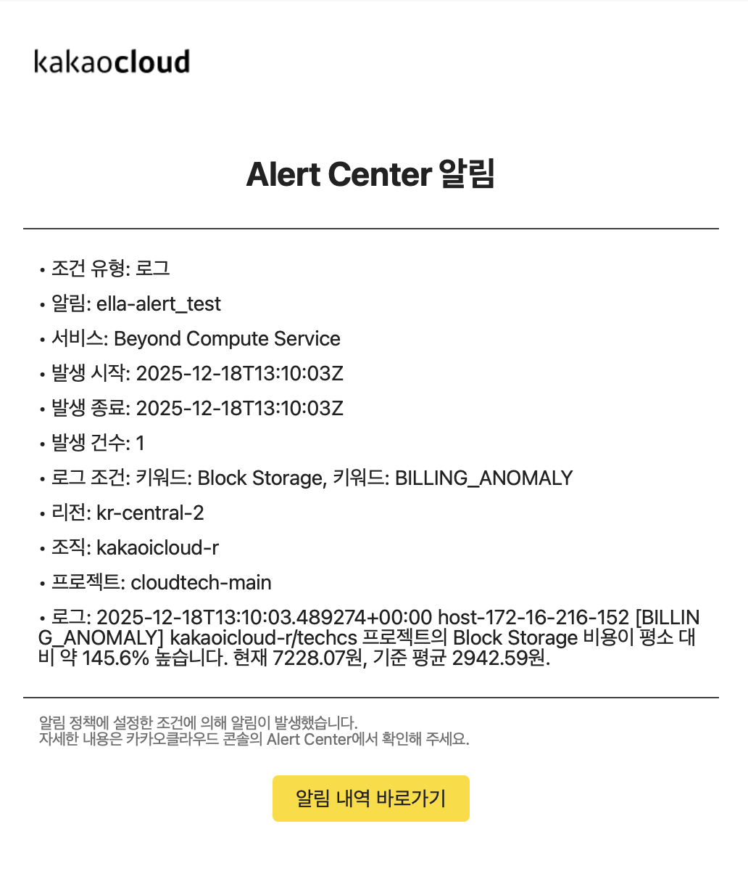
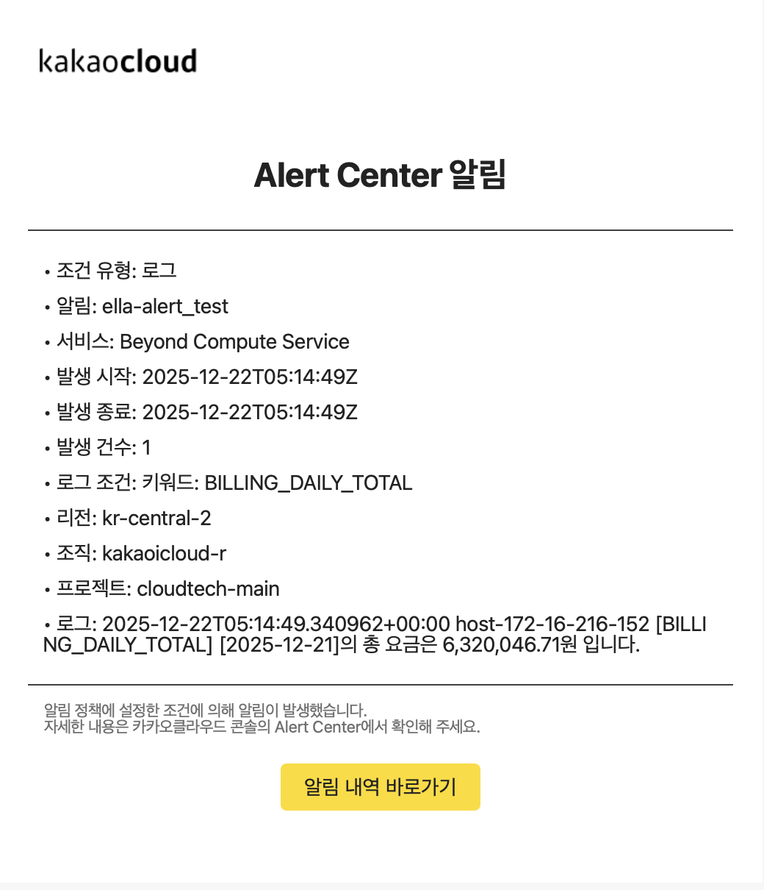

import PublicIP from '@site/src/components/PublicIP'
import EditableCodeBlock from '@site/src/components/EditableCodeBlock'
import Tabs from '@theme/Tabs';
import TabItem from '@theme/TabItem';

> Billing API를 활용하여 Billing 이상치 탐지 결과를 Alert Center(로그 기반)로 연동하는 방법을 소개합니다.

:::info 기본 정보
- 예상 소요 시간: 40분<br/>
- 권장 운영 체제: MacOS, Ubuntu 24.04<br/>
- 사전 준비 사항
  - [IAM, S3 액세스 키](/start/console-guide/credentials#get-s3-access-key)
  - Billing API에서 조회 가능한 과거 비용 데이터
:::

:::info 안내
본 튜토리얼을 진행하려면 Billing API에서 조회 가능한 최소 30일치 Billing 데이터(과거 데이터)가 필요합니다.
:::

## 시나리오 소개 {#about-this-scenario}

이 튜토리얼에서는 카카오클라우드 **Billing API**와 **Alert Center**를 연동하여 비용 이상치를 자동으로 탐지하고 알림을 발송하는 방법을 소개합니다.  
시간대별 비용 데이터의 기준선을 기반으로 이상치를 탐지함으로써, 예기치 않은 비용 증가를 조기에 인지하고 운영 리스크를 줄일 수 있습니다.

:::info 정보
이상치 탐지는 현재 비용을 기준선(baseline)과 비교해, **Z-score가 임계값(3.0)을 넘거나** 또는 **평균 대비 비율(Deviation Ratio)이 임계값(2.0)을 넘는 경우**(비용 급증)로 판단합니다. 여기서 기준선(baseline)은 사용자가 Mongodb에 적재한 과거 일별 집계 데이터를 바탕으로 서비스별 통계를 계산한 값입니다.
:::


*Hourly Job*


*Daily Job*


본 튜토리얼에서는 다음과 같은 흐름으로 비용 이상치 탐지 및 알림 파이프라인이 동작합니다:

- **Daily Job**은 매일 한 번 실행되어 Billing API로부터 전날의 비용 데이터를 수집합니다. 수집한 데이터는 **MongoDB**에 일별 집계 형태로 저장되고, **Object Storage**에는 원본 JSON 데이터가 날짜별로 보관됩니다. Daily Job은 저장된 과거 데이터를 기반으로 각 서비스별 기준선(baseline) 통계를 재계산하며, 일별 총 비용 정보를 syslog로 기록합니다.

- **Hourly Job**은 매 시간마다 실행되어 **MongoDB**에 저장된 기준선 통계와 현재 시간대의 비용 데이터를 비교합니다. 통계적 방법을 사용하여 이상치를 탐지하고, 이상치가 발견되면 **MongoDB**에 이상치 이력을 저장한 뒤 syslog로 기록합니다.

- **Alert Center**는 **Billing Collector VM**의 Monitoring Agent를 통해 수집합니다. 사용자가 설정한 키워드 기반 알림 정책에 따라 이상치 발생 시나 일별 총 비용 정보가 감지되면, 설정된 수신 채널(이메일, 문자, 슬랙 등)로 실시간 알림을 발송합니다.

이러한 파이프라인을 통해 예기치 않은 비용 증가를 조기에 인지하고, 운영 리스크를 사전에 관리할 수 있습니다.


## 시작하기 전에 {#before-you-start}

본 튜토리얼을 진행하기 전에, 실습에 필요한 네트워크 및 기본 인프라 환경을 사전에 구성해야 합니다.  
사전 작업으로 VPC와 서브넷, 보안 그룹을 설정하고, Bastion 인스턴스를 생성합니다.

### 1. VPC와 서브넷 설정
카카오클라우드에서 컴퓨팅 환경을 구축하기 전에 먼저 VPC와 서브넷의 설정이 필요합니다. 이를 위해, [다중 가용 영역에서 NAT 인스턴스를 이용한 네트워크 구축 문서](https://docs.kakaocloud.com/tutorial/networking-content-delivery/private-subnet)를 참조하여 프라이빗 서브넷에 존재하는 리소스들이 외부 통신이 가능하도록 네트워크 환경을 구축하세요.
이 튜토리얼의 실습에 필요한 네트워크 설정은 다중 가용 영역에서 NAT 인스턴스를 이용한 네트워크 구축 문서에서 정한 값에 기반합니다.

### 2. 보안 그룹 설정 {#2-configure-security-groups}

1. **[카카오클라우드 콘솔](https://console.kakaocloud.com) > Beyond Networking Service > VPC  > 보안 그룹**으로 이동합니다.

2. 우측의 [보안 그룹 생성] 버튼을 클릭하여 새 보안 그룹 생성합니다. 

   <details>
   <summary> 보안 그룹: tutorial-bastion-sg </summary>

   1. 보안 그룹 이름과 설명을 아래와 같이 입력합니다.

      | 이름 | 설명(선택)  |
      | ---- | ---- |
      | tutorial-bastion-sg | Bastion 호스트의 보안정책 |

   2. 하단의 [+ 추가하기] 버튼을 클릭 후, 인바운드 조건을 아래와 같이 설정하고 [적용] 버튼을 클릭합니다. <br/>
      :::tip 나의 퍼블릭 IP 확인하기
      다음 버튼을 클릭하면 현재 사용 중인 나의 퍼블릭 IP를 확인할 수 있습니다. <br/>
      **<PublicIP />**  
      :::

      | 추가할 인바운드 규칙 | 항목    | 설정값  |
      | ---- | ----- | ------- |
      | bastion inbound policy 1 | 프로토콜 | `TCP`  |
      | | 패킷 출발지 | `{사용자 퍼블릭 IP}/32`    |
      | | 포트 번호    | 10000-10010  |
      | | 정책 설명(선택) | fowd-bastion |
      | bastion inbound policy 2 | 프로토콜 | `TCP`  |
      | | 패킷 출발지 | `{사용자 퍼블릭 IP}/32`    |
      | | 포트 번호    | 81 |
      | | 정책 설명(선택) | manage-bastion |
      | bastion inbound policy 3 | 프로토콜 | `TCP`  |
      | | 패킷 출발지 | `{사용자 퍼블릭 IP}/32`    |
      | | 포트 번호    | 22 |
      | | 정책 설명(선택) | ssh-bastion |
      | bastion inbound policy 4 | 프로토콜 | `ICMP`  |
      | | 패킷 출발지 | `{사용자 퍼블릭 IP}/32`    |
      | | 포트 번호    | ALL |
      | | 정책 설명(선택) | ping-bastion |

   </details>

   <details>
   <summary> 보안 그룹: tutorial-cronjob-sg </summary>

   1. 보안 그룹 이름과 설명을 아래와 같이 입력합니다.

      | 이름    | 설명(선택)   |
      | ----- | ----- |
      | tutorial-cronjob-sg | Billing Collector VM의 보안정책 |

   2. 보안 그룹을 생성합니다. 인바운드 규칙은 이후 단계에서 추가합니다.

   </details>

   <details>
   <summary> 보안 그룹: tutorial-mongo-sg </summary>

   1. 보안 그룹 이름과 설명을 아래와 같이 입력합니다.

      | 이름    | 설명(선택)  |
      | ----- | ------- |
      | tutorial-mongo-sg | MongoDB 인스턴스의 보안정책 |

   2. 하단의 [+ 추가하기] 버튼을 클릭 후, 인바운드 조건을 아래와 같이 설정하고 [적용] 버튼을 클릭합니다.

      | 추가할 인바운드 규칙 | 항목    | 설정값  |
      | ---- | ----- | ------- |
      | mongodb inbound policy 1   | 프로토콜 | `TCP`   |
      |  | 패킷 출발지 | `SUBNET_CIDR` |
      |  | 포트 번호    | 27017    |
      |  | 정책 설명(선택) | conn-mongo  |
      | mongodb inbound policy 2   | 프로토콜 | `ICMP`   |
      |  | 패킷 출발지 | `SUBNET_CIDR` |
      |  | 포트 번호    | ALL    |
      |  | 정책 설명(선택) | ping-mongo  |

   </details>

### 3. Bastion 인스턴스 생성 {#3-create-bastion-instance}


1. [카카오클라우드 콘솔](https://console.kakaocloud.com) > **Beyond Compute Service > Virtual Machine** 메뉴로 이동합니다.
2. **인스턴스** 탭에서 [인스턴스 생성] 버튼을 클릭한 후, 다음과 같이 VM 인스턴스를 생성합니다.

   | 구분   | 항목    | 설정/입력값    | 비고  |
   | ----- | ------- | ----- | ----- |
   | 기본 정보 | 이름    | tutorial-bastion  |  |
   |    | 개수    | 1 |  |
   | 이미지  | | Ubuntu 24.04   |  |
   | 인스턴스 유형 | | m2a.large |  |
   | 볼륨 | 루트 볼륨				    | 30GB    |  |
   | 키 페어  | | `{USER_KEYPAIR}`  | ⚠️ 키 페어는 최초 1회 안전하게 보관해야 합니다. <br/>잃어버린 키는 복구할 수 없으며, 재발급이 필요합니다. |
   | 네트워크    | VPC    | tutorial  |  |
   |    | 서브넷  | main (10.0.0.0/20)    |  |
   |    | 보안 그룹 | `tutorial-bastion-sg` |  |


## 시작하기 {#getting-started}

### Step 1. 주요 리소스 생성 {#step-1-create-main-resources}

본 튜토리얼에 필요한 주요 리소스인 MongoDB VM과 Billing Collector VM 인스턴스를 생성합니다.

#### MongoDB 인스턴스 생성
비용/이상치 데이터의 저장 및 조회 기반을 마련하기 위해, MongoDB VM 인스턴스를 생성합니다.

1. [카카오클라우드 콘솔](https://console.kakaocloud.com) > **Beyond Compute Service > Virtual Machine** 메뉴로 이동합니다.
2. **인스턴스** 탭에서 [인스턴스 생성] 버튼을 클릭한 후, 다음과 같이 VM 인스턴스를 생성합니다.

   | 구분 | 항목 | 설정/입력값 | 비고 |
   | ----- | ------- | ----- | ---- |
   | 기본 정보 | 이름 | `tutorial-mongo` |  |
   |    | 개수 | 1 |  |
   | 이미지 |  | Ubuntu 24.04 |  |
   | 인스턴스 유형 |  | m2a.large |  |
   | 볼륨 | 루트 볼륨 | 30GB |  |
   | 키 페어 |  | `{USER_KEYPAIR}` | 상기 작업에서 사용했던 기존 키 페어 사용 |
   | 네트워크 | VPC | `tutorial` |  |
   |    | 서브넷 | `tutorial_{VPC_ID}_sn_2 (10.0.16.0/20)` |  |
   |    | 보안 그룹 | `tutorial-mongo-sg` |  |

#### Billing Collector VM 인스턴스 생성
Billing 데이터 수집과 이상치 탐지 등 배치성 비즈니스 로직 실행 기반을 마련하기 위해, Billing Collector VM 인스턴스를 생성합니다.

1. [카카오클라우드 콘솔](https://console.kakaocloud.com) > **Beyond Compute Service > Virtual Machine** 메뉴로 이동합니다.
2. **인스턴스** 탭에서 [인스턴스 생성] 버튼을 클릭한 후, 다음과 같이 VM 인스턴스를 생성합니다.

   | 구분 | 항목 | 설정/입력값 | 비고 |
   | ----- | ------- | ----- | ---- |
   | 기본 정보 | 이름 | `tutorial-cronjob` |  |
   |    | 개수 | 1 |  |
   | 이미지 |  | Ubuntu 24.04 |  |
   | 인스턴스 유형 |  | m2a.large |  |
   | 볼륨 | 루트 볼륨 | 30GB |  |
   | 키 페어 |  | `{USER_KEYPAIR}` | 상기 작업에서 사용했던 기존 키 페어 사용 |
   | 네트워크 | VPC | `tutorial` |  |
   |    | 서브넷 | `tutorial_{VPC_ID}_sn_2 (10.0.16.0/20)` |  |
   |    | 보안 그룹 | `tutorial-cronjob-sg` |  |


### Step 2. Bastion 호스트 설정 {#step-2-configure-bastion-host}
Bastion 서버는 Billing Collector VM과 MongoDB 서버의 게이트웨이이며, 외부에서 접근할 수 있도록 퍼블릭 IP를 부여해야 합니다.


1. **Virtual Machine > 인스턴스** 탭에서 위에서 생성했던 `Bastion` 인스턴스를 선택 후, 우측의 [퍼블릭 IP 연결] 버튼을 클릭합니다.

   - 연결된 퍼블릭 IP는 **네트워크** 탭에서 확인할 수 있습니다.

2. 로컬 환경에서 터미널 실행 후, `cd` 명령어를 사용하여 키 페어 파일을 다운로드받은 폴더로 이동합니다.

   - 키 파일을 최초 생성해서 사용했다면, 기본적으로 다운로드 폴더에 저장됩니다. (`cd ~/Downloads`)

3. 다음 명령어를 실행하여 SSH 접근합니다.

   <EditableCodeBlock language="shell">
   ```shell 
   chmod 400 $(PRIVATE_KEY::키 파일 이름).pem # 읽기 권한 부여
   ssh -i $(PRIVATE_KEY::키 파일 이름).pem ubuntu@$(BASTION_PUBLIC_IP:: Virtual Machine > 인스턴스 메뉴에서 생성해둔 `Bastion` 인스턴스 클릭 후, 네트워크 탭에서 확인)
   ```
   </EditableCodeBlock>

4. Nginx Proxy Manager를 실행하기 위해, 먼저 Bastion 호스트를 구성합니다. 다음의 명령어로 프로비저닝을 수행합니다.

   ```bash
   sudo curl -o /tmp/install-bastion.sh https://raw.githubusercontent.com/kakaoenterprise/kakaocloud-tutorials/bastion-host/install-bastion.sh
   bash /tmp/install-bastion.sh
   ```

5. 사용자 로컬 환경에서 브라우저를 열고, 아래 주소를 입력하여 관리 페이지에 접속합니다.

   - `http://${BASTION_PUBLIC_IP}:81/login`

   * ID : `admin@example.com`
   * 비밀번호 : `changeme`

   | 항목 | 설명  |
   | ---- | ---- |
   | `{BASTION_PUBLIC_IP}` | **Virtual Machine > 인스턴스 메뉴**에서 생성해둔 `Bastion` 인스턴스를 클릭 후, **네트워크** 탭에서 확인 |

6. **Dashboard > Streams**로 이동합니다.

7. 다음과 같이 Billing Collector VM/MongoDB의 호스트 정보를 각각 입력합니다.

   | 구분    | 항목   | 설정값  |
   | ----- | ------- | ----|
   | tutorial-cronjob | Incoming Port | 10000 | 
   | | Forward Host  | 생성해둔 `tutorial-cronjob` 인스턴스의 프라이빗 IP <br/> - **Virtual Machine > 인스턴스 메뉴**에서 생성해둔 `tutorial-cronjob` 인스턴스를 클릭 후, **네트워크** 탭에서 확인 |
   | | Forward Port  | 22  | 
   | tutorial-mongo | Incoming Port | 10001 | 
   | | Forward Host  | 생성해둔 `tutorial-mongo` 인스턴스의 프라이빗 IP <br/> - **Virtual Machine > 인스턴스 메뉴**에서 생성해둔 `tutorial-mongo` 인스턴스를 클릭 후, **네트워크** 탭에서 확인 |
   | | Forward Port  | 22  |

8. 내부 호스트로 들어오는 트래픽은 Bastion을 통해 전달됩니다. 따라서 Billing Collector VM/MongoDB 인스턴스가 Bastion에서 보낸 트래픽을 받을 수 있도록 보안 그룹을 다음과 같이 설정합니다.

<details>
  <summary>Billing Collector VM 인스턴스</summary>

      1. **Virtual Machine > 인스턴스 메뉴**으로 이동 후, 생성해둔 `tutorial-cronjob` 인스턴스를 클릭합니다.
      2. **보안** 탭에서 하이퍼링크 처리된 **tutorial-cronjob-sg**를 클릭 후, **인바운드 규칙 관리**를 선택합니다.
      3. [추가하기] 버튼을 클릭하여, 다음과 같이 인바운드 규칙을 추가하고 [적용] 버튼을 클릭합니다.

      :::caution 주의
      [적용] 버튼을 클릭하지 않으면 저장되지 않습니다.
      :::

      | 구분 | 항목    | 설정값   |
      | ---- | ----- | ----------|
      | Billing Collector VM  | 프로토콜 | `TCP`    |
      |  | 패킷 출발지 | `{BASTION_PRIVATE_IP}/32` <br/> - **Virtual Machine > 인스턴스 메뉴**에서 생성해둔 `Bastion` 인스턴스를 클릭 후, **네트워크** 탭에서 확인 |
      |  | 포트 번호    | 22  |
      |  | 정책 설명(선택) | billing collector vm inbound policy    |

</details>

<details>
  <summary>MongoDB 인스턴스</summary>

      1. **Virtual Machine > 인스턴스 메뉴**으로 이동 후, 생성해둔 `tutorial-mongo` 인스턴스를 클릭합니다.
      2. **보안** 탭에서 하이퍼링크 처리된 **tutorial-mongo-sg**를 클릭 후, **인바운드 규칙 관리**를 선택합니다.
      3. [추가하기] 버튼을 클릭하여, 다음과 같이 인바운드 규칙을 추가하고 [적용] 버튼을 클릭합니다.

      :::caution 주의
      [적용] 버튼을 클릭하지 않으면 저장되지 않습니다.
      :::

      | 구분 | 항목    | 설정값   |
      | ---- | ----- | ----------|
      | MongoDB  | 프로토콜 | `TCP`    |
      |  | 패킷 출발지 | `{BASTION_PRIVATE_IP}/32` <br/> - **Virtual Machine > 인스턴스 메뉴**에서 생성해둔 `Bastion` 인스턴스를 클릭 후, **네트워크** 탭에서 확인 |
      |  | 포트 번호    | 22  |
      |  | 정책 설명(선택) | mongodb inbound policy    |

</details>

9. 로컬에서 포워딩 SSH 접속 확인
키 페어 파일이 존재하는 폴더로 이동하여 실행합니다.

    ```bash
    # Billing Collector VM 접속
    ssh -i ${PRIVATE_KEY}.pem ubuntu@${BASTION_PUBLIC_IP} -p 10000

    # MongoDB VM 접속
    ssh -i ${PRIVATE_KEY}.pem ubuntu@${BASTION_PUBLIC_IP} -p 10001
    ```

| 환경 변수 | 설명 |
|---|---|
| `PRIVATE_KEY` | 키파일 이름 |
| `BASTION_PUBLIC_IP` | Virtual Machine > 인스턴스 메뉴에서 생성해둔 Bastion 인스턴스 클릭 후, 네트워크 탭에서 확인 |


### Step 3. MongoDB 환경 구축 {#step-3-setup-mongodb}

MongoDB 서버는 Billing 비용/이상치/baseline 데이터를 저장하고 조회하는 DB 서버입니다.  
이 단계에서는 MongoDB를 설치·구성한 뒤, mongo-express를 통해 데이터 적재/조회가 정상인지 웹 UI로 확인합니다.

#### MongoDB 설치  {#install-mongodb}

1. 인스턴스에 MongoDB를 설치합니다.

   ```bash
   sudo apt-get update
   sudo apt-get install -y gnupg curl

   curl -fsSL https://pgp.mongodb.com/server-7.0.asc \
    | sudo gpg --dearmor -o /usr/share/keyrings/mongodb-server-7.0.gpg

   echo "deb [ arch=amd64,arm64 signed-by=/usr/share/keyrings/mongodb-server-7.0.gpg ] \
   https://repo.mongodb.org/apt/ubuntu noble/mongodb-enterprise/7.0 multiverse" \
   || sudo tee /etc/apt/sources.list.d/mongodb-enterprise.list

   sudo apt-get update
   sudo apt-get install -y mongodb-enterprise
   sudo systemctl stop mongod
   ```

2. MongoDB의 데이터 및 로그를 저장할 디렉터리를 생성합니다.

   ```bash
   sudo mkdir -p /data/mongodb
   sudo mkdir -p /data/log/mongodb
   ```

3. 생성된 디렉터리에서 작업할 수 있도록 권한을 설정합니다.

   ```bash
   sudo chown -R mongodb:mongodb /data/*
   ```

4. MongoDB 프로세스가 생성한 디렉터리에 정보를 저장하도록 값을 수정합니다. `/data/mongodb`에 데이터를 저장하고 `/data/log/mogodb/mongod.log` 파일에 로그를 작성합니다.

   ```bash
   cat <<EOF | sudo tee /etc/mongod.conf
   storage:
       dbPath: /data/mongodb

   systemLog:
       destination: file
       logAppend: true
       path: /data/log/mongodb/mongod.log

   net:
       port: 27017
       bindIp: 0.0.0.0

   processManagement:
       timeZoneInfo: /usr/share/zoneinfo
   EOF
   ```

5. MongoDB 프로세스를 시작합니다.

   ```bash
   sudo service mongod start
   ```

#### MongoDB 컬렉션 생성
MongoDB에 데이터 적재를 시작하기 전에, 본 튜토리얼에서 사용하는 컬렉션(`billing_baseline`, `billing_daily`, `billing_anomalies`)을 미리 생성해 둡니다.

| 컬렉션 | 역할 |
|---|---|
| `billing_daily` | Billing API 원본 데이터를 집계한 결과를 저장합니다. **집계키는 날짜(meteringDate), 도메인(domainId), 프로젝트(projectId), 서비스(serviceId)의 조합**이며, 동일한 집계키를 가진 데이터는 합산되어 저장됩니다. 이 데이터는 이상치 탐지의 기준 데이터로 사용됩니다. |
| `billing_baseline` | 도메인-프로젝트-서비스별 **기준선 통계(mean/std 등)** 저장 (이상치 탐지에 사용) |
| `billing_anomalies` | **이상치 이력** 저장 |


```bash
mongosh
use billing
db.createCollection("billing_baseline")
db.createCollection("billing_daily")
db.createCollection("billing_anomalies")
exit
```

#### mongo-express 설치 및 Bastion 터널링 접속
mongo-express는 MongoDB 데이터를 웹 UI로 조회/검증하기 위한 도구입니다.
MongoDB VM에서 mongo-express를 8081로 띄운 뒤, Bastion 경유로 로컬에 포워딩하여 접속합니다.

1. MongoDB VM에 접속한 뒤 아래를 실행합니다.

    ```bash
    sudo apt-get update
    sudo apt-get install -y docker.io
    sudo systemctl enable --now docker

    sudo docker run -d --name mongo-express --restart unless-stopped --network host \
      -e ME_CONFIG_MONGODB_URL="mongodb://127.0.0.1:27017" \
      -e ME_CONFIG_BASICAUTH_USERNAME="admin" \
      -e ME_CONFIG_BASICAUTH_PASSWORD="changeme" \
      mongo-express:latest
    ```

2. 로컬 PC에서 Bastion 경유 터널링 접속
아래 명령을 로컬 PC에서 실행합니다. 

    ```bash
    ssh -i ${KEYPAIR_NAME}.pem -p 10001 -L 8081:127.0.0.1:8081 ubuntu@${BASTION_PUBLIC_IP}
    ```

3. 이후 브라우저에서 `http://localhost:8081`로 접속하여, 웹 UI를 통해 생성한 컬렉션 및 데이터를 조회·검증할 수 있으며, 컬렉션 생성·삭제 등 MongoDB 데이터 관리 작업을 수행할 수 있습니다. (계정: `admin` / 비밀번호: `changeme`)

    
    *mongo-express 접속 예시*

### Step 4. Object Storage 버킷 생성 {#step-4-create-object-storage-bucket}

Object Storage 콘솔에서 Billing Raw 데이터를 저장하는 데 사용할 버킷을 생성합니다. 버킷 생성 방법에 대한 자세한 내용은 [버킷 생성 문서](/service/bss/object-storage/how-to-guides/object-storage-manage-bucket)를 참조하십시오.

:::info 안내
Daily Job은 Billing API 원본 응답(JSON)을 Object Storage에 저장합니다. 저장 경로 규칙은 다음과 같습니다.  
 ex) `raw/year=2025/month=12/day=21/billing_20251221.json`
:::

### Step 5. Billing Collector VM에 프로젝트 배포 및 설정 {#step-5-deploy-project-to-billing-collector-vm}

Billing Collector VM은 Billing API로부터 비용 데이터를 주기적으로 수집하고, 이상치 탐지 로직을 배치 작업으로 실행하는 애플리케이션 서버입니다.  
Billing Collector VM에 프로젝트를 배포한 뒤, 실행에 필요한 라이브러리 설치와 `settings.yaml` 구성을 완료합니다.

1. nginx-proxy-manager에서 설정한 포트에 맞게 매핑해둔 VM으로 접속합니다.

    ```bash
    # tutorial-cronjob
    ssh -i ${PRIVATE_KEY}.pem ubuntu@${BASTION_PUBLIC_IP} -p 10000
    ```

    | 환경 변수 | 설명 |
    |---|---|
    | `PRIVATE_KEY`🖌︎ | 키파일 이름 |
    | `BASTION_PUBLIC_IP`🖌︎ | Virtual Machine > 인스턴스 메뉴에서 생성해둔 Bastion 인스턴스 클릭 후, 네트워크 탭에서 확인 |

2. 예제 프로젝트를 설치하고 실행하는 데 필요한 기본 패키지를 설치합니다.

    ```bash
    sudo apt update
    sudo apt install -y git python3 python3-pip
    ```

    ```bash
    git clone ${GITHUB_REPO_URL} billing_tutorial
    cd ~/billing_tutorial
    sudo pip3 install -r requirements.txt
    ```

3. 프로젝트 실행에 필요한 환경 변수를 입력합니다.

    ```bash
    vi config/settings.yaml
    ```

    ```yaml
    billingApi:
      credentialId: "${IAM 액세스 키 ID}"
      credentialSecret: "${보안 액세스 키}"

    mongo:
      uri: "mongodb://${MONGO_PRIVATE_IP}:27017/billing"
      dbName: "billing"

    objectStorage:
      endpoint: "https://objectstorage.kr-central-2.kakaocloud.com"
      bucket: "${BUCKET_NAME}"
      accessKey: "${S3_ACCESS_KEY_ID}"
      secretKey: "${S3_SECRET_KEY}"
    ```

    | 환경변수 | 설명 |
    |---|---|
    | `IAM 액세스 키 ID`| IAM 액세스 키 생성 시점 또는 IAM 액세스 키 목록에서 해당 IAM 액세스 키 항목을 클릭하여 조회 가능 |
    | `보안 액세스 키` | IAM 액세스 키 생성 시점에만 조회 가능 |
    | `MONGO_PRIVATE_IP` | Virtual Machine > 인스턴스 메뉴에서 생성해둔 `tutorial-mongo` 인스턴스 클릭 후, 네트워크 탭에서 확인 |
    | `BUCKET_NAME` | Object Storage 콘솔에서 생성한 버킷 이름 |
    | `S3_ACCESS_KEY_ID` | 사전 작업에서 발급받은 액세스 키 ID |
    | `S3_SECRET_KEY` | 사전 작업에서 발급받은 시크릿 키 |

### Step 6. MongoDB 초기 데이터 준비 {#step-6-prepare-mongodb-initial-data} 

baseline(기준선) 계산을 위해서는 과거 비용 데이터가 필요하므로, Daily Job을 수동으로 실행시켜 데이터를 먼저 적재합니다.

:::caution 주의
초기 데이터 적재를 위해서는 Billing API에서 조회 가능한 **최소 30일치 Billing 데이터(과거 데이터)**가 준비되어 있어야 합니다.
:::
:::info 안내
이 단계에서는 Step 7의 Alert Center 알림 정책이 아직 설정되지 않은 상태이므로, 초기 데이터 적재 시 알림이 발송되지 않습니다.
:::

1. 사용자 데이터로 baseline 구성
  Daily Job을 과거 날짜로 반복 실행하여 `billing_daily` 컬렉션에 과거 비용 데이터를 저장한 후, baseline을 재계산합니다.

    예시(2025년 11월 한 달 적재):
    ```bash
    for d in $(seq -w 1 30); do
      python3 jobs/daily_job.py --config config/settings.yaml --date 202511${d}
    done
    ```

2. Step 3에서 설정한 mongo-express를 통해 일별 집계 결과(`billing_daily`)와 각 서비스별 평균 및 표준편차 등 기준선 통계(`billing_baseline`) 데이터 적재 결과를 확인할 수 있습니다.


*billing_daily 적재 확인*


*billing_baseline 생성 확인*

### Step 7. Alert Center 로그 알림 설정 {#step-7-configure-alert-center-log-notification}

#### Monitoring Agent 설치
Billing Collector VM에 Monitoring Agent를 설치하고, syslog를 수집하도록 설정합니다. 설치 방법에 대한 자세한 내용은 [모니터링 에이전트 설치 문서](/service/management/monitoring/how-to-guides/monitoring-install-agent)를 참조하십시오.

> 참고: Ubuntu는 보통 `/var/log/syslog`에 로그가 남습니다. 환경에 따라 `/var/log/messages`를 사용하기도 하니 에이전트 설정에 맞춰 확인하세요.

#### Alert Center에서 수신 채널 생성
카카오클라우드의 Alert Center에서 알림 수신 채널을 생성할 수 있습니다.

:::info 안내
알림을 정상적으로 수신하기 위해, 휴대폰 번호를 정확히 입력해야 합니다. 자세한 설정 방법은 [계정 정보 수정](/start/console-guide/modify-account-info) 가이드를 참고하시기 바랍니다.
:::

1. Management > Alert Center > 수신 채널을 선택합니다.

2. [수신 채널 생성] 버튼을 클릭합니다.

3. 수신 채널의 정보를 입력하고, 채널 유형을 선택 후, [생성] 버튼을 클릭합니다.

| 구분 | 설명 |
|---|---|
| 기본 채널 | 이메일/ 문자/ 카카오톡으로 해당 알림을 전송 |
| 슬랙/ 웹훅 | 원하는 슬랙 채널에서 해당 알림을 전송 |

#### 알림 정책 설정
카카오클라우드의 Alert Center에서 로그 기반 알림 정책을 설정할 수 있습니다.

1. Alert Center > 수신 채널에서 [알림 정책 생성] 버튼을 클릭합니다.

2. 필요한 알림 조건을 설정 후, [생성] 버튼을 클릭합니다.

    | 항목 | 값 |
    |---|---|
    | 조건 유형 | 로그 |
    | 서비스 | Beyond Compute Service |
    | 조건 설정 | - 키워드: **이상치 서비스 모니터링을 원하는 서비스**를 키워드로 입력합니다. <br /> &nbsp;&nbsp;-  `BILLING_ANOMALY`를 **AND 조건으로 추가**합니다. <br /> - Daily Job에서 전날 총 요금을 syslog로 남기므로, 해당 알림도 키워드로 정책을 추가합니다: **`BILLING_DAILY_TOTAL`** |
    | 수신 채널 | 사전에 설정한 수신 채널 선택 |
    | 알림 정책 이름 | tutorial-alert-log |
    | 사용 여부 | 사용 |

### Step 8. Cron 등록 및 자동 실행 확인 {#step-8-register-cron-and-verify-auto-execution}

**Billing Collector VM**에 접속하여 cron을 등록합니다. cron 등록을 통해 **Hourly Job**은 매 시간마다 이상치 탐지 및 알림을 자동으로 수행하고, **Daily Job**은 하루 한 번 **Object Storage**에 데이터 적재 및 일일 총 비용 안내 알림을 자동으로 수행합니다.

1. Billing Collector VM 접속
    ```bash
    ssh -i ${PRIVATE_KEY}.pem ubuntu@${BASTION_PUBLIC_IP} -p 10000
    ```

2. Hourly Job과 Daily Job을 자동으로 실행하기 위해 cron 작업을 등록하는 스크립트를 실행합니다. 

    ```bash
    cd ~/billing_tutorial
    ./scripts/setup_cron.sh add
    ```

3. 스크립트 실행 후 표시되는 cron 등록 결과를 확인합니다.

    
    *cron 설정 결과*

### Step 9. 스케줄러 검증 및 alert 확인 {#step-9-verify-scheduler-and-alert}

**Billing Collector VM**에 접속하여 **Hourly Job** 과 **Daily Job** 를 직접 실행해, 결과를 확인합니다.

1. Billing Collector VM 접속
```bash
ssh -i ${PRIVATE_KEY}.pem ubuntu@${BASTION_PUBLIC_IP} -p 10000
```

#### Hourly Job 수동 실행

```bash
cd ~/billing_tutorial
python3 jobs/hourly_job.py --config config/settings.yaml

# (선택) 특정 날짜로 재현하고 싶다면
# python3 jobs/hourly_job.py --config config/settings.yaml --date 20251221
```

1. 이상치가 탐지되면 mongodb 이상치 컬렉션에 적재됩니다.

2. 이상치가 탐지되면 알림이 발송됩니다.


#### Daily Job 수동 실행

원하는 날짜를 `--date` 옵션으로 지정하여 실행할 수 있습니다.

```bash
cd ~/billing_tutorial
python3 jobs/daily_job.py --config config/settings.yaml --date 20251222
```

1. Daily Job 실행 후, Step 4에서 안내한 경로 규칙에 맞게 **Raw JSON이 Object Storage 버킷에 생성**되는지 확인합니다.

2. 대상 날짜 집계에 포함된 서비스들에 대해 baseline 통계가 갱신됩니다.

3. 일일 총 비용 집계 결과에 대한 알림이 발송됩니다.


